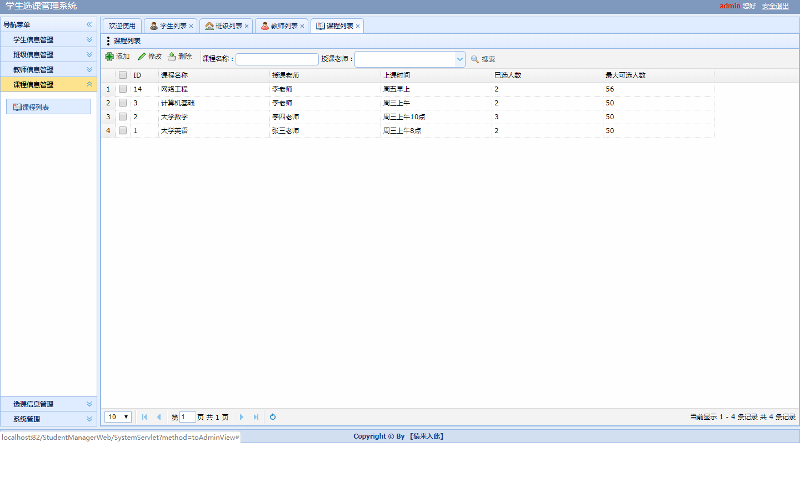

ssm学生考勤管理系统

项目代码已收录公众号【java项目源码】，需要请自行关注一下公众号并下载源码

框架：ssm+mysql+layui+ajax+mvc模式+jquery

1.学生：可以进行选课，可以管理请假信息，管理自己的信息，修改密码

2.教师：对学生进行管理（增删改查），对班级和课程进行管理（增删改查）,对选课信息进行管理，
可以对考勤信息进行管理以及对请假信息的审核等操作

3.管理员：对学生和教师进行管理（增删改查），对班级和课程进行管理（增删改查）,对选课信息进行管理，
可以对考勤信息进行管理以及对请假信息的审核等操作

CSDN博客地址：[ssm学生考勤管理系统](https://blog.csdn.net/mataodehtml/article/details/118410081)

运行视频地址：[ssm学生考勤管理系统](https://www.bilibili.com/video/BV18X4y1P71Y)

